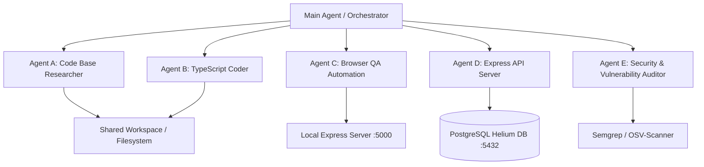

# Area 2, 7 & 16 — Autonomous Agent Infrastructure & Persistence
## Process Supervision, Lifecycle Hooks, Background Execution, and Multi-Agent Architecture

### 1. Process Supervision & Container Persistence Infrastructure

This environment runs inside a Replit microVM container governed by a dual-pid init daemon structure:

1. **`pid1` (Init Daemon)**:
   - Binary: `/nix/store/ab3bi0gbb9bcsjl97napnw61gik6mzhh-pid1-0.0.1/bin/pid1`
   - Function: Manages cgroups, pseudo-filesystems, vsock communication, and microVM lifecycle.
2. **`pid2` (Process Supervisor)**:
   - Binary: Node.js supervisor (`/mnt/pid2/server.cjs`)
   - Function: Manages child process spawning, socket listening, pinging, and daemon pooling.

#### Persistence Characteristics Matrix

| Mechanism | Lives Across Command Exit? | Lives Across Session Disconnect? | Lives Across MicroVM Sleep? | Agent Suitability | Status |
| :--- | :---: | :---: | :---: | :--- | :---: |
| **Foreground Shell** | No | No | No | Interactive execution only | **VERIFIED** |
| **Background Task (`&` / `nohup`)** | Yes | Yes | Sub-session | Short-to-medium autonomous tasks | **VERIFIED** |
| **Replit Dev Server (`pnpm run dev`)** | Yes | Yes | Maintained while workspace active | Dev web server execution | **VERIFIED** |
| **Replit Artifact Router (`artifact-router`)** | Yes | Yes | Active during web traffic | Microservice daemon management | **VERIFIED** |
| **Scheduled Deployment** | Yes | Yes | Persistent trigger | Cron-like periodic agent execution | **DOCUMENTED** |
| **Reserved VM Deployment** | Yes | Yes | 24/7 Continuous | Permanent autonomous agent host | **DOCUMENTED** |

---

### 2. Replit Workspace Automation & Lifecycle Hooks

Replit configuration (`.replit`) exposes declarative hooks for lifecycle events:

```toml
modules = ["nodejs-24"]

[deployment]
router = "application"
deploymentTarget = "autoscale"

[deployment.postBuild]
args = ["pnpm", "store", "prune"]
env = { "CI" = "true" }

[workflows]
runButton = "Project"

[agent]
stack = "PNPM_WORKSPACE"
expertMode = true

[postMerge]
path = "scripts/post-merge.sh"
timeoutMs = 20000
```

1. **`postMerge` Hook**: `scripts/post-merge.sh` automatically executes with a 20-second timeout whenever code is merged into the branch.
2. **`postBuild` Hook**: Executes after production builds (e.g. pruning pnpm store).
3. **`[agent]` Directives**: Explicitly configures the agent stack (`PNPM_WORKSPACE`) and activates `expertMode = true`.

---

### 3. Multi-Agent Topology & Feasibility Analysis

This environment is fully capable of hosting a local multi-agent system where a main orchestrator delegates tasks to specialized sub-agents via inter-process communication (IPC) or local HTTP endpoints.



#### Multi-Agent Implementation Options
1. **Subagent Tool Calling (`invoke_subagent` / `send_message`)**: Pre-built native subagent invocation protocol (VERIFIED).
2. **Local HTTP Microservices**: Agents run lightweight Express/FastAPI servers listening on distinct ports (`5001`, `5002`, `5003`) communicating via JSON REST APIs (VERIFIED).
3. **Model Context Protocol (MCP)**: Agents act as MCP servers/clients communicating over stdio pipes or WebSockets using `@modelcontextprotocol/sdk` (VERIFIED).
4. **Unix Domain Sockets**: Process-to-process streaming communication via `/run/replit/socks` or `/tmp` domain sockets (VERIFIED).
