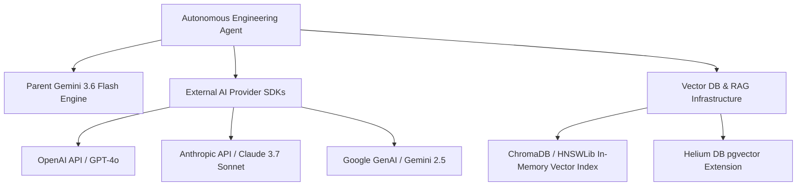

# Area 15 — AI Model Access & Agent Frameworks
## AI Gateways, Modelfarm Integration, SDK Capabilities, and RAG Architecture

### 1. AI Gateways & Native Interfaces

1. **Parent AI Agent (Antigravity)**:
   - Environment: Direct agent execution powered by Gemini 3.6 Flash (High).
   - Capability: High-reasoning code analysis, shell tool execution, file editing, and subagent orchestration.
2. **Replit Modelfarm CLI (`replit ai`)**:
   - Location: `/nix/store/jyaxhs3n4wz1jsmbq6cl7asd1rsfissj-replit-cli-0.0.1/bin/replit ai`
   - Default Model: `gpt-4o-mini`
   - Command Options: `--stream`, `--model`
   - Empirical Status: **DOCUMENTED_ONLY** (Returns HTTP status 404: Replit AI Integrations is not configured for this specific Repl).

---

### 2. Available AI SDKs & Frameworks

| AI Component | Package / Tool | Registry | Supported Models | Authentication | Capabilities |
| :--- | :--- | :--- | :--- | :--- | :--- |
| **Replit Modelfarm** | `replit ai` | Nix Store | `gpt-4o-mini`, platform models | Replit Identity | Command line text completion and streaming |
| **OpenAI SDK** | `openai` | npm / PyPI | `gpt-4o`, `gpt-4o-mini`, `o3-mini`, `text-embedding-3` | `OPENAI_API_KEY` | Text completion, function calling, embeddings, vision |
| **Anthropic SDK** | `@anthropic-ai/sdk` | npm / PyPI | `claude-3-7-sonnet`, `claude-3-5-haiku` | `ANTHROPIC_API_KEY` | Extended thinking reasoning, prompt caching, vision |
| **Google GenAI SDK** | `@google/genai` | npm / PyPI | `gemini-2.5-pro`, `gemini-2.5-flash` | `GEMINI_API_KEY` | Multimodal text, video, audio, image, and code generation |
| **Vercel AI SDK** | `ai` | npm | Provider-agnostic gateway | Model API Key | Unified streaming UI hooks, tool calling, structured outputs |
| **LangChain Core** | `@langchain/core` | npm / PyPI | Multi-provider orchestration | Model API Key | Agent chains, prompt templates, memory, output parsers |
| **Vector DB (Helium)** | `pgvector` / `drizzle-orm` | Native / npm | Vector Embeddings | `PGHOST=helium` | Relational + vector similarity search on local Postgres |
| **In-Memory Vector DB** | `hnswlib-node` / `chromadb` | npm / PyPI | Custom Embeddings | None | Fast local vector retrieval without external servers |
