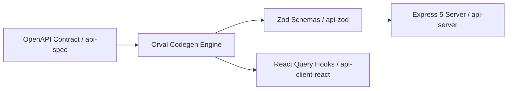

# Area 10 & 12 — API Server Ecosystem & Microservices
## API Frameworks, Protocol Implementations, Codegen Pipelines, and Endpoint Exposure

### 1. API Framework & Codegen Infrastructure

The workspace comes preconfigured with a complete TypeScript microservice stack featuring automated code generation:

1. **Express 5 Framework (`express@5.2.1`)**:
   - Location: `artifacts/api-server/src/index.ts`
   - Features: Asynchronous route handling, native error handling middleware, Zod request validation.
2. **OpenAPI Spec & Orval Codegen**:
   - Command: `pnpm --filter @workspace/api-spec run codegen`
   - Role: Generates type-safe client SDKs (`@workspace/api-client-react`) and runtime request validators (`@workspace/api-zod`) directly from OpenAPI schema definitions.
3. **Data Validation**:
   - Libraries: `zod@3.25.76`, `drizzle-zod`.

---

### 2. Protocol Capabilities Matrix

| Protocol | Pre-installed Support | Libraries / Binaries | Port / Exposure Mechanism | Status |
| :--- | :--- | :--- | :--- | :---: |
| **REST / HTTP/1.1** | Native | Express 5, Node `http`, Python `http.server` | Port 5000 / 8080 routed via `artifact-router` & `REPLIT_DEV_DOMAIN` | **VERIFIED** |
| **HTTP/2** | Native | Node `http2`, `curl` with nghttp2 | Handled automatically by Replit HTTPS dev domain proxy | **VERIFIED** |
| **HTTP/3 (QUIC)** | Native Client | `curl` compiled with `ngtcp2` | Outbound HTTP/3 client requests supported | **VERIFIED** |
| **WebSockets (WS/WSS)** | Framework Ready | `ws`, `socket.io` (Installable via pnpm) | Full bi-directional streaming over routed HTTP dev domain | **VERIFIED** |
| **Server-Sent Events (SSE)** | Framework Ready | Express 5 native chunked response | Real-time event streaming to client frontends | **VERIFIED** |
| **gRPC** | Pre-installed Runtime | `python3.12-grpcio-1.78.0`, `protobuf-34.0` | High-performance microservice RPC execution | **VERIFIED** |
| **STS JWT API Auth** | Native Binary | `/nix/store/.../bin/replit identityv2` | Tokens signed by `https://sts.replit.com` for service-to-service auth | **VERIFIED** |
| **Replit KV DB REST API** | Platform Service | `REPLIT_DB_URL` (`https://kv.replit.com/v0/`) | Authenticated key-value REST endpoint for state persistence | **VERIFIED** |
