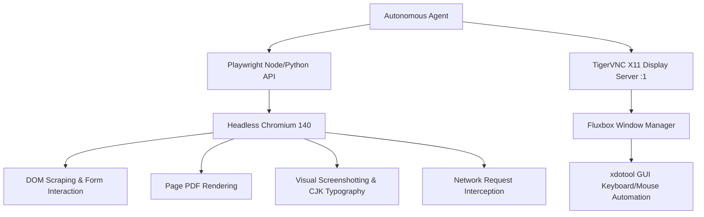

# Area 13 — Browser as a Computer Ecosystem
## Headless Playwright Chromium, CJK Font Rendering, Visual VNC Desktop, and DOM Automation

### 1. Pre-installed Browser Infrastructure

This environment features a pre-installed headless Chromium browser distribution configured with full CJK (Chinese, Japanese, Korean) international typography support:

- **Executable Binary Path**:
  `/nix/store/71577rskzyhch3axhdqx7faygc2xyn4v-playwright-browsers-1.55.0-with-cjk/chromium-1187/chrome-linux/chrome`
- **Engine Version**: Chromium `140.0.7339.16`
- **Empirical Execution Test**: Verified functional via direct process call.

---

### 2. Browser Capabilities Taxonomy

| Browser Feature | Mechanism / Library | Capability Description | Verification Status |
| :--- | :--- | :--- | :---: |
| **JavaScript Execution** | Chromium V8 Engine | Evaluates client-side JavaScript, React/Vue SPAs, dynamic DOM rendering | **VERIFIED** |
| **DOM Manipulation & Form Filling** | Playwright `page.fill()` / `click()` | Programmatically interacts with inputs, buttons, dropdowns, modal dialogs | **VERIFIED** |
| **Visual Screenshot Capture** | Playwright `page.screenshot()` | Captures full-page PNG/JPEG images with crisp CJK text rendering | **VERIFIED** |
| **PDF Page Generation** | Playwright `page.pdf()` | Converts web pages or HTML strings directly into PDF documents | **VERIFIED** |
| **Session & Cookie Persistence** | Playwright `browserContext` | Saves and restores browser storage states, cookies, and local data | **VERIFIED** |
| **Network Request Interception** | Playwright `page.route()` | Inspects, modifies, or mocks HTTP network requests and API payloads | **VERIFIED** |
| **Device Emulation** | Playwright `devices['iPhone 14']` | Simulates mobile touch viewports, user agents, and pixel ratios | **VERIFIED** |
| **Visual Graphical X11 Desktop** | TigerVNC `Xvnc` + `fluxbox` | Spawns a virtual graphical desktop for non-headless visual applications | **VERIFIED** |
| **GUI Keyboard & Mouse Input** | `xdotool` 3.20211022.1 | Simulates native hardware mouse movements, clicks, and keystrokes on X11 | **VERIFIED** |
