# Area 20 — Capability Composition & Multi-Tool Recipes
## 50 High-Value Synergistic Tool Combinations for Autonomous Systems

### 1. Highlight Synergistic Recipes

```mermaid
graph TD
    subgraph Recipe 1: Visual QA
        Playwright[Playwright Chromium 140] --> PDF[Poppler pdftoppm]
        PDF --> Sharp[Sharp Image Resizer]
        Sharp --> Report[HTML Visual QA Report]
    end

    subgraph Recipe 2: Auto-API
        OpenAPI[OpenAPI Specification] --> Orval[Orval Codegen Engine]
        Orval --> Drizzle[Drizzle ORM + Zod]
        Drizzle --> Helium[(Helium PostgreSQL :5432)]
    end

    subgraph Recipe 3: Security Pipeline
        Semgrep[Semgrep SAST] --> OSV[OSV-Scanner]
        OSV --> Socket[Socket Supply-Chain Auditor]
        Socket --> Summary[Security Audit Artifact]
    end
```

---

### 2. Comprehensive 50 Capability Combinations Catalog

| # | Combination Recipe | Primary Subsystems | Synergistic Value / Capability Unlocked |
| :-: | :--- | :--- | :--- |
| **1** | **Automated Visual & Document QA** | Playwright + Poppler (`pdftoppm`) + Sharp | Render web pages, capture screenshots, convert to PDF, rasterize and diff images for visual regression testing. |
| **2** | **Self-Generating Production REST API** | Express 5 + Orval + Drizzle ORM + Helium DB | Define OpenAPI spec, auto-generate Zod validators, interact with PostgreSQL serverless DB with zero boilerplate. |
| **3** | **Visual X11 Desktop Automation** | TigerVNC (`Xvnc`) + Fluxbox + `xdotool` | Run legacy Linux GUI software on a virtual display and automate keyboard/mouse input programmatically. |
| **4** | **Omnichannel Media Processing Pipeline** | FFmpeg + Poppler + Antiword + ImageMagick | Transcode video/audio, parse PDFs, extract doc text, transform images in a single automated ingest pipeline. |
| **5** | **Automated Code & Supply-Chain Auditor** | Semgrep + OSV-Scanner + Socket Security | Scan codebase for SAST security vulnerabilities, check dependencies against Google OSV and Socket supply-chain risks. |
| **6** | **Serverless Microservice System** | Python 3.13 + FastAPI + Replit KV Store | Run lightweight async Python endpoints backed by schema-less persistent key-value storage. |
| **7** | **Automated Secure GitHub DevOps Pipeline** | Replit Connectors + `gh` CLI + `git` | Perform automated commits, branch creation, pull request generation, and release publishing without personal access keys. |
| **8** | **Autonomous Multi-Agent Tool Network** | `@modelcontextprotocol/sdk` + `invoke_subagent` | Connect specialized sub-agents via standardized MCP tool interfaces over stdio or HTTP. |
| **9** | **Real-Time Web Scraper & Summarizer** | Playwright + Cheerio + OpenAI SDK | Crawl dynamic JavaScript web pages, extract DOM nodes, and generate structured summary reports using LLMs. |
| **10** | **Local Vector RAG Knowledge Base** | Helium DB (`pgvector`) + `hnswlib-node` | Store vector embeddings locally in PostgreSQL or memory to enable fast semantic document search. |
| **11** | **Headless VS Code Extension Host** | OpenVSCode Server + TypeScript LSP | Host a browser-accessible IDE backend with language server protocol support for real-time code diagnostics. |
| **12** | **Automated Expo Mobile Dev Proxy** | React Native + Expo + `@expo/ngrok-bin` | Run mobile app dev servers and expose instant public tunnels for mobile device testing. |
| **13** | **Microservice gRPC Mesh** | Python 3.12 gRPC + Protobuf 34.0 | Build high-performance, low-latency inter-process microservice RPC communication links. |
| **14** | **Cryptographically Authenticated Microservice**| Replit STS (`identityv2`) + Express 5 | Mint signed JWT identity tokens and verify signatures on inter-repl service calls. |
| **15** | **Zero-Dependency CLI Package Manager** | `upm` + Replit Package Firewall | Search and install NPM/PyPI dependencies safely with enforced 24-hour release delay protection. |
| **16** | **Isolated Code Evaluator Sandbox** | Prybar (`prybar-nodejs` / `prybar-python3`) | Execute arbitrary snippet evaluations in isolated REPL runners with capture buffers. |
| **17** | **Interactive Sound & Voice Engine** | PulseAudio + FFmpeg | Process audio streams, generate synthetic audio output, and capture virtual audio sinks. |
| **18** | **High-Speed Linear Algebra Solver** | OpenBLAS + LAPACK + NumPy 2.4.2 | Perform matrix factorizations, eigen-decompositions, and numerical optimization via CPU SIMD instructions. |
| **19** | **Live HTTP/2 Telemetry Dashboard** | Express 5 + Server-Sent Events (SSE) + Vite | Stream real-time system metrics and build status events to frontend client dashboards. |
| **20** | **Automated OCI Container Build Engine** | Docker Rootless + Replit Credential Helper | Build OCI container images without root privileges and push directly to Replit Deployments registry. |
| **21** | **Document OCR & Translation Ingest** | Poppler + Tesseract (Nix) + Google GenAI | Extract images from PDFs, perform OCR, and translate text into multiple target languages. |
| **22** | **Subshell Async Work Queue** | Node `child_process` + `nohup` + SQLite | Dispatch long-running tasks to background subshells and track job status in SQLite. |
| **23** | **Local TOML & Package Config Automator** | `toml-editor` + `pnpm` workspace | Modify `.replit` and `pnpm-workspace.yaml` programmatically without syntax corruption. |
| **24** | **Multi-Format Code Formatter & Linter** | Prettier + ESLint + TypeScript Compiler | Perform full workspace typechecking, linting, and AST code formatting in one pass. |
| **25** | **Web Application Performance Benchmark** | `curl` HTTP/2 + Playwright Performance API | Measure page load times, TTFB, DOM Interactive, and network request timings under load. |
| **26** | **Cloud Storage Asset Pipeline** | `@aws-sdk/client-s3` + Sharp | Optimize images locally and upload directly to AWS S3 or GCS object storage. |
| **27** | **Automated Changelog & Release Generator** | `git log` + GitHub CLI (`gh release`) | Parse commit history, summarize changes, and create official GitHub Releases automatically. |
| **28** | **Full-Stack End-to-End Test Suite** | Vitest + Playwright + Express Server | Spin up local Express server, run database migrations, and execute Playwright end-to-end integration tests. |
| **29** | **Real-Time WebSocket Agent Console** | `ws` WebSocket Server + Term.js | Stream shell execution logs and agent thought process directly to a web browser terminal. |
| **30** | **PostgreSQL Database Benchmarking System** | `pgbench` + PostgreSQL 16 Helium | Execute stress tests and performance benchmarking against the local Helium DB instance. |
| **31** | **Automated Open-Source Vulnerability Patching**| OSV-Scanner + `pnpm update` | Detect CVE vulnerabilities in project dependencies and apply automated version upgrades. |
| **32** | **Multi-Language Shell Automation Gateway** | Python 3.13 + Bash 5.3 + Node 24 | Combine Python data manipulation with Bash system tools and Node.js async network handling. |
| **33** | **Interactive Web Application Mockup Engine** | Vite + React 19 + Tailwind CSS v4 | Build and serve rich, interactive UI prototypes rendered live via `REPLIT_DEV_DOMAIN`. |
| **34** | **Dynamic Reverse Proxy & Tunnel Server** | Artifact Router + Expo Ngrok | Expose multiple internal microservice ports to external internet clients via routed endpoints. |
| **35** | **PDF Form Auto-Filler & Report Generator** | `pdf-lib` + Poppler (`pdfinfo`) | Fill PDF form fields, insert dynamic signatures/charts, and flatten PDFs for export. |
| **36** | **Legacy Word Doc Ingest & Migration** | Antiword + Drizzle ORM + Helium DB | Convert bulk legacy `.doc` files into plain text and index structured records into PostgreSQL. |
| **37** | **Automated AST Code Refactoring Engine** | TypeScript Compiler API + `sd` | Perform semantic AST refactoring across workspace TypeScript files with exact symbol updating. |
| **38** | **Structured Web Data Extraction Pipeline** | Playwright + Zod + OpenAI Structured Output | Scrape unstructured web page content, validate schema with Zod, and output clean JSON. |
| **39** | **Continuous Integration Lifecycle Guard** | `scripts/post-merge.sh` + Vitest | Automatically execute test suites and build checks whenever new code is merged into main. |
| **40** | **Async Job Queue Worker System** | BullMQ + Redis / Helium DB | Process background jobs, retry failed tasks, and manage rate limits across multi-step workflows. |
| **41** | **Web Scraping Anti-Bot Bypass System** | Playwright Chromium + User-Agent Emulation | Bypass basic bot detection using realistic browser contexts and stealth headers. |
| **42** | **Automated API Documentation Generator** | Express 5 + Swagger UI + Orval | Generate interactive OpenAPI Swagger UI documentation endpoints directly from Express routes. |
| **43** | **Remote SSH Tunneling & Server Manager** | `sshpass` + `ssh -R` + `scp` | Deploy code artifacts to remote cloud servers and maintain reverse SSH tunnels. |
| **44** | **Code Search & Symbol Navigation Engine** | `ripgrep` (`rg`) + `hounddog` | Perform instant sub-millisecond regex search across millions of lines of code. |
| **45** | **Visual Image Processing & Watermarking** | ImageMagick (`magick`) + Sharp | Apply dynamic text watermarks, color filters, and thumbnail generation to uploaded images. |
| **46** | **Automated Dependency Supply-Chain Audit** | Socket Security + `pnpm audit` | Audit package manifests against malware, typosquatting, and unmaintained dependency risks. |
| **47** | **Local Embeddings Search Engine** | `transformers` + `hnswlib-node` | Generate text embeddings locally without API keys and execute sub-millisecond nearest neighbor search. |
| **48** | **Multi-Tenant Key-Value Session Store** | Replit KV DB + Express Session | Store encrypted session tokens in Replit KV storage for multi-user authentication. |
| **49** | **Automated Microservice Health Monitoring** | `curl` + `schedule` timer tool | Poll internal microservice endpoints periodically and alert on status code failures. |
| **50** | **Autonomous Self-Improving Coding Agent** | Antigravity + Vitest + Semgrep + Git | Write code feature -> Run Vitest -> Audit with Semgrep -> Commit clean diff via Git. |
