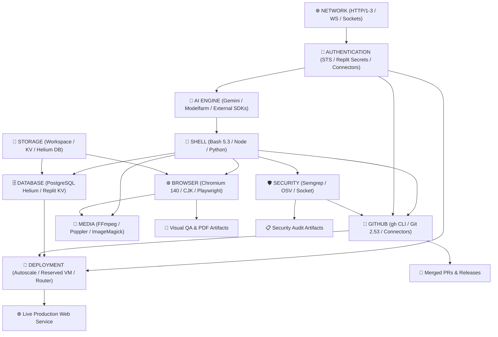

# Area 21 — Agent Capability Graph
## Dependency Mapping, Execution Pathways, and High-Leverage Node Network

### 1. High-Leverage Capability Node Network Diagram

---

### 2. High-Leverage Node Analysis

1. **SHELL Node (Highest Leverage Execution Core)**
   - **Dependencies**: Linux container filesystem, process supervisor (`pid1`/`pid2`).
   - **Authentication**: Native container user `runner`.
   - **Network**: Local sockets & loopback interface.
   - **Storage**: `/home/runner/workspace` and `/tmp`.
   - **Execution Output**: Subprocess invocation, CLI executions, binary spawning.

2. **DATABASE Node (Relational & State Storage Core)**
   - **Dependencies**: PostgreSQL 16 server (`helium:5432`), Replit KV REST API.
   - **Authentication**: `PGPASSWORD=password`, `REPLIT_DB_URL` JWT token.
   - **Network**: Local container network (`172.24.0.3`) and outbound HTTPS (`kv.replit.com`).
   - **Storage**: Persistent Helium DB volume & Replit KV store.
   - **Execution Output**: Relational schemas, ORM queries, persistent state.

3. **BROWSER Node (Visual & DOM Interaction Core)**
   - **Dependencies**: Chromium 140 binary, CJK font packages, `playwright-core`.
   - **Authentication**: Session state, cookies, optional VNC credentials.
   - **Network**: Outbound HTTP/HTTPS requests & local WebSocket dev tools protocol.
   - **Storage**: Browser profile cache `/home/runner/.cache/ms-playwright-go`.
   - **Execution Output**: DOM element inspection, PDF files, full-page screenshots.

4. **GITHUB Node (Source Code & DevOps Core)**
   - **Dependencies**: `/repl/ctls/bin/gh`, `git` 2.53, OpenSSH client.
   - **Authentication**: Replit OAuth Connectors token.
   - **Network**: HTTPS API (`api.github.com`) & SSH (`git@github.com`).
   - **Storage**: Workspace `.git` directory.
   - **Execution Output**: Automated commits, pull requests, release notes, workflow triggers.
