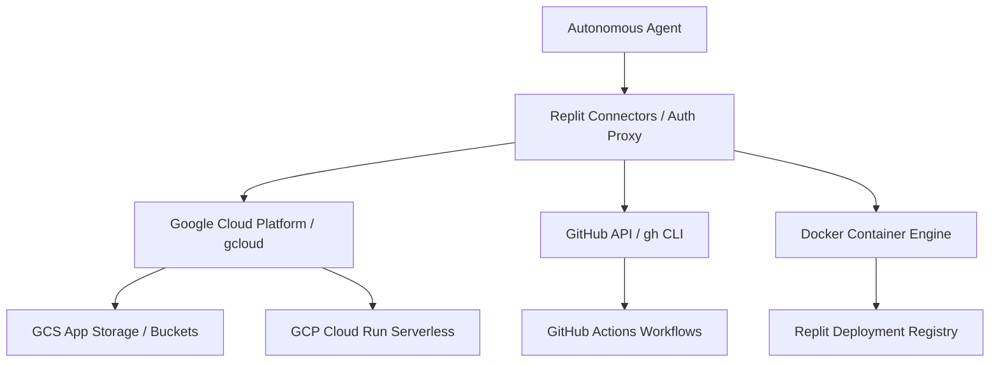

# Area 10 — Cloud Ecosystem & Container Discovery
## Cloud SDKs, Command Line Tools, Container Engines, and Cloud Capabilities

### 1. Pre-installed Cloud Tools & SDKs

The environment contains pre-installed cloud command-line tools integrated into Replit's Connectors infrastructure:

| Cloud Platform | Binary Location | Version | Connector Status | Capabilities |
| :--- | :--- | :--- | :--- | :--- |
| **Google Cloud (GCP)** | `/repl/ctls/bin/gcloud` | `552.0.0` | Integrated via Replit Connectors | Full GCP resource management, GCS buckets, Cloud Run, Vertex AI |
| **GitHub Infrastructure** | `/repl/ctls/bin/gh` | `2.88.1` | Integrated via Replit Connectors | Repository management, GitHub Actions, secrets, PRs, releases |
| **Docker Container Engine** | `/nix/store/3mb5pci3.../bin/docker` | `27.5.1` | Rootless Docker (`dockerd-rootless`) | Building OCI container images, containerized testing |
| **Replit Deployment Driver** | `/nix/store/3mb5pci3.../bin/docker-credential-replit-deploy` | Custom build | Replit Connector | Authenticating container pushes directly to Replit Deployments registry |

---

### 2. Cloud Platform Capability Matrix

| Cloud Ecosystem | SDK / CLI Tool | Installation Status | Authentication Mechanism | Theoretical Agent Capabilities |
| :--- | :--- | :---: | :--- | :--- |
| **Google Cloud Platform** | `gcloud` (v552) | **PRE-INSTALLED** | Replit OAuth Connectors / ADC | Manage Cloud Storage, Cloud Functions, GKE, Vertex AI models |
| **GitHub** | `gh` (v2.88) | **PRE-INSTALLED** | Replit OAuth Connectors / Personal Token | Manage repos, trigger Actions, manage PRs, configure secrets |
| **Docker / OCI** | `docker` (v27.5) | **PRE-INSTALLED** | Local daemon / Replit credential helper | Build container images, execute multi-container stacks via Compose |
| **Amazon Web Services (AWS)** | `@aws-sdk/*` / `boto3` | **INSTALLABLE** | AWS Access Key / Secret Key env vars | S3 bucket upload/download, DynamoDB CRUD, Lambda invocation |
| **Supabase** | `@supabase/supabase-js` | **INSTALLABLE** | Supabase Anon / Service Role Key | Postgres queries, real-time subscriptions, file storage |
| **Cloudflare** | `wrangler` | **INSTALLABLE** | Cloudflare API Token | Deploy Workers, KV storage, R2 bucket management |
| **Vercel** | `vercel` CLI | **INSTALLABLE** | Vercel Token | Serverless deployment, domain DNS management |
