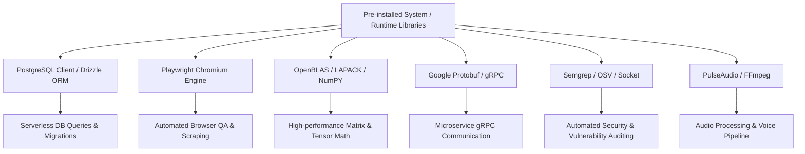

# Area 3 & 5 — Secondary Tools & Latent Capabilities
## Inventory of Non-PATH Tools and Library-to-Capability Mappings

### 1. Secondary Tool Inventory (Pre-installed Non-PATH / Latent Binaries)

While standard CLI discovery checks `$PATH`, this environment contains over 400 pre-installed utilities in `/nix/store` and specialized paths that unlock advanced engineering capabilities without installing additional software.

| Tool Name | Binary Location / Path | Version / Build | Primary Capability | Verification Status |
| :--- | :--- | :--- | :--- | :---: |
| **Python 3.13 Interpreter** | `/nix/store/pzdalg368npikvpq4ncz2saxnz19v53k-python3-3.13.12/bin/python3` | Python 3.13.12 | Scripting, Async IO, HTTP servers, math, SQLite | **VERIFIED** |
| **Playwright Chromium** | `/nix/store/71577rskzyhch3axhdqx.../chrome` | Chromium 140.0.7339.16 | Headless Web Scraping, PDF generation, UI Testing | **VERIFIED** |
| **TigerVNC Server** | `/nix/store/3mb5pci3.../bin/vncserver` / `Xvnc` | TigerVNC 1.14.0 | Virtual Graphical X11 Desktop Server | **VERIFIED** |
| **X11 Desktop Managers** | `/nix/store/3mb5pci3.../bin/fluxbox` / `ratpoison` | Fluxbox / Ratpoison | Lightweight X11 Window Management | **VERIFIED** |
| **X11 GUI Automation** | `/nix/store/3mb5pci3.../bin/xdotool` | xdotool 3.20211022.1 | Programmatic mouse/keyboard events on X11 GUI | **VERIFIED** |
| **Poppler PDF Suite** | `/nix/store/3mb5pci3.../bin/pdftoppm` | Poppler 25.07.0 | Convert PDF to PNG/JPEG/HTML, extract text & images | **VERIFIED** |
| **FFmpeg Multimedia Suite** | `/nix/store/3mb5pci3.../bin/ffmpeg` | FFmpeg 6.1.2 | Video/Audio transcoding, frame extraction, clipping | **VERIFIED** |
| **ImageMagick 7** | `/nix/store/3mb5pci3.../bin/magick` | ImageMagick 7.x | Image transformations, resizing, format conversion | **VERIFIED** |
| **Semgrep SAST Scanner** | `/nix/store/3mb5pci3.../bin/semgrep` | Semgrep 1.152.0 | Static application security testing across 30+ languages | **VERIFIED** |
| **OSV-Scanner** | `/nix/store/3mb5pci3.../bin/osv-scanner` | OSV-Scanner 2.3.3 | Vulnerability scanning against Google OSV database | **VERIFIED** |
| **Socket Security Scanner** | `/nix/store/3mb5pci3.../bin/socket` | Socket 1.11.147 | NPM/PyPI dependency supply-chain security audit | **VERIFIED** |
| **PulseAudio Engine** | `/nix/store/3mb5pci3.../bin/pulseaudio` | PulseAudio 17.x | Virtual audio sink, audio recording and playback | **VERIFIED** |
| **Microsoft Word Extractor** | `/nix/store/3mb5pci3.../bin/antiword` | Antiword 0.37 | Binary `.doc` file plain text extraction | **VERIFIED** |
| **OpenVSCode Server** | `/nix/store/3mb5pci3.../bin/openvscode-server` | OpenVSCode 1.101.2 | Headless VS Code IDE server over HTTP/WebSockets | **VERIFIED** |
| **PostgreSQL Admin Suite** | `/nix/store/3mb5pci3.../bin/pg_ctl` / `psql` | PostgreSQL 16.10 | Database management, dump/restore, benchmarks | **VERIFIED** |

---

### 2. Library-to-Capability Mapping Matrix

When no standalone CLI executable is in PATH, pre-installed or installable libraries provide full access to external capabilities:

| Library / Module | Source / Package | Exposed APIs | Unlocked Latent Capability |
| :--- | :--- | :--- | :--- |
| `pg` / `drizzle-orm` | npm workspace | `Client`, `Pool`, `drizzle()` | Full relational DB CRUD, transactions, migrations against Helium DB |
| `playwright-core` | nix store / npm | `chromium.launch()` | Headless browser automation, full JS execution, network interception |
| `OpenBLAS` / `LAPACK` | nix store | C/Fortran BLAS symbols | CPU-accelerated linear algebra, matrix operations, tensor calculations |
| `protobuf` / `grpcio` | nix store (Python 3.12) | `grpc.insecure_channel()` | High-performance gRPC microservice client/server execution |
| `antiword` | nix store | CLI / C interface | Reading legacy `.doc` office documents without Microsoft Office |
| `pdftoppm` / `pdftotext` | nix store | Poppler C++ / CLI | Document text extraction, rasterizing PDF pages to images |
| `semgrep` / `osv-scanner` | nix store | CLI / JSON output | Automated AST security rule enforcement and vulnerability checking |
| `openvscode-server` | nix store | HTTP / WebSockets | Web-based IDE access and remote extensions loading |
| `xdotool` + `Xvnc` | nix store | X11 display socket `:1` | Full visual GUI desktop automation for legacy Linux software |
