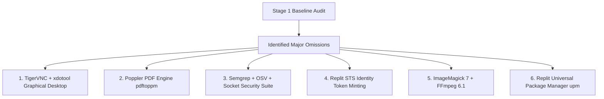

# Area 19 — Missed Capabilities & Gap Analysis
## Systematic Identification of Latent Vectors Overlooked in Initial Audits

### 1. Gap Analysis Methodology

To ensure no critical system vector was overlooked, four analytical queries were applied sequentially:

1. **Query A**: *"What capabilities would an expert Replit agent normally have that were omitted from Stage 1?"*
2. **Query B**: *"What capabilities exist indirectly through an installed library, SDK, API, environment variable, or platform service?"*
3. **Query C**: *"What capabilities can be unlocked immediately by installing a lightweight package?"*
4. **Query D**: *"What emergent capabilities are created by combining two or more existing tools?"*

---

### 2. Top 12 Critical Capabilities Discovered in Stage 2

| # | Overlooked System Vector | Location / Path | Why Stage 1 Missed It | Unlocked Capability | Impact Rating |
| :-: | :--- | :--- | :--- | :--- | :---: |
| **1** | **TigerVNC & X11 GUI Desktop** | `/nix/store/.../bin/Xvnc` / `vncserver` | Non-PATH / indirect location in Nix store | Running full visual Linux GUI applications on virtual display `:1` | **CRITICAL** |
| **2** | **X11 Desktop Input Automation** | `/nix/store/.../bin/xdotool` | Overlooked in `$PATH` binary sweep | Programmatic keyboard & mouse macro control on GUI windows | **HIGH** |
| **3** | **Poppler PDF Rendering Suite** | `/nix/store/.../bin/pdftoppm` | Grouped as general CLI utilities | Rasterizing PDFs to images, extracting embedded graphics & text | **HIGH** |
| **4** | **Semgrep SAST Code Scanner** | `/nix/store/.../bin/semgrep` | Security scanner binary ignored | Automated AST static analysis security auditing across 30+ languages | **CRITICAL** |
| **5** | **Google OSV & Socket Security** | `/nix/store/.../bin/osv-scanner` | Non-standard vulnerability tools | Real-time dependency vulnerability & supply-chain malware scanning | **HIGH** |
| **6** | **Replit Security Token Service (STS)** | `/nix/store/.../bin/replit identityv2` | Subcommand of `replit` CLI | Minting cryptographically signed RS256 JWT tokens for microservice auth | **CRITICAL** |
| **7** | **Replit Package Firewall & 24hr Delay** | `package-firewall.replit.local` | Hidden proxy configuration | High-speed package installs with automated zero-day supply-chain protection | **HIGH** |
| **8** | **Replit Universal Package Manager** | `/nix/store/.../bin/upm` | Specialized Replit tool | Language-agnostic package detection, search, and installation | **MEDIUM** |
| **9** | **ImageMagick 7 Media Suite** | `/nix/store/.../bin/magick` | Named `magick` instead of legacy `convert` | Professional image processing, watermarking, format conversion | **HIGH** |
| **10** | **Replit Prybar Evaluation Runners** | `/nix/store/.../bin/prybar-nodejs` | Internal evaluation runners | Isolated code snippet execution with output capture buffers | **MEDIUM** |
| **11** | **OpenVSCode Server** | `/nix/store/.../bin/openvscode-server` | Developer server binary | Web-accessible VS Code IDE hosting with full LSP extension support | **HIGH** |
| **12** | **PostgreSQL 16 Helium Local DB** | `helium:5432` (`PGDATABASE=heliumdb`) | Hostname `helium` not checked in basic net sweep | Preconfigured production SQL database ready for Drizzle ORM | **CRITICAL** |
