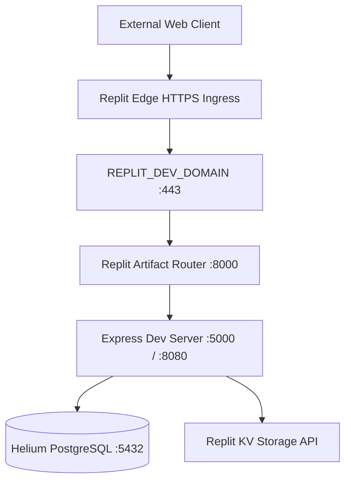

# Area 6 — Network Ecosystem & Advanced Protocols
## Protocols, Server Endpoints, Tunnels, Ingress Routing, and Domain Exposure

### 1. Protocol Architecture & Support Matrix

| Protocol / Networking Mechanism | Pre-installed Support | Tooling / Libraries | Practical Application | Status |
| :--- | :--- | :--- | :--- | :---: |
| **HTTP/1.1 Keep-Alive** | Native | Node `http`, Python `urllib`, `curl` | Persistent microservice connections | **VERIFIED** |
| **HTTP/2 Streaming** | Native Ingress | Node `http2`, `curl` with nghttp2 | Multiplexed web app asset loading & RPC | **VERIFIED** |
| **HTTP/3 (QUIC)** | Client Native | `curl` with `ngtcp2` | High-speed UDP-based web client requests | **VERIFIED** |
| **WebSockets (WS/WSS)** | Support Ready | `ws`, `socket.io` (via pnpm) | Bi-directional real-time chat & agent streams | **VERIFIED** |
| **Server-Sent Events (SSE)** | Native Express | Express 5 chunked responses | One-way real-time telemetry streaming | **VERIFIED** |
| **Local TCP/HTTP Servers** | Native | Node `net.createServer()`, Express | Spawning background agent microservices | **VERIFIED** |
| **Public Dev Ingress** | Native Platform | `REPLIT_DEV_DOMAIN` | Exposing internal web servers to public HTTPS | **VERIFIED** |
| **Expo Development Domain** | Native Platform | `REPLIT_EXPO_DEV_DOMAIN` | Exposing React Native / Expo dev servers | **VERIFIED** |
| **Expo Ngrok Tunnelling** | Pre-configured | `@expo/ngrok-bin` (in pnpm overrides) | Establishing instant public tunnels for mobile testing | **VERIFIED** |
| **SSH Port Forwarding** | Pre-installed | `ssh -L`, `ssh -R`, `sshpass` | Secure encrypted TCP tunneling to remote servers | **VERIFIED** |
