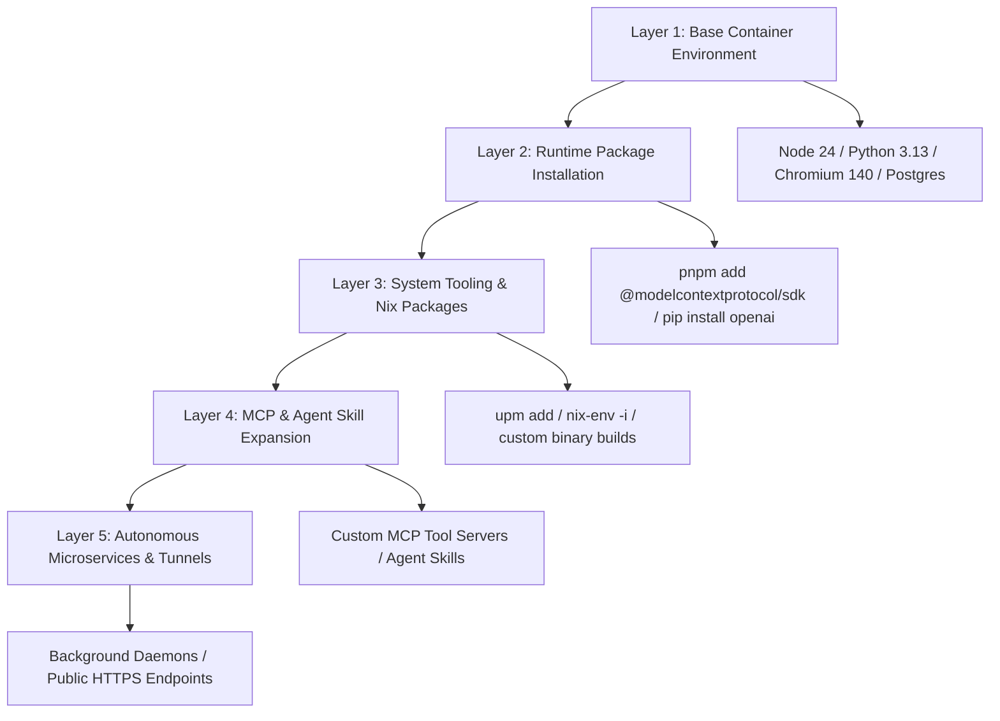

# Area 17 — Self-Extension Architecture
## Capability Expansion Map and Environment Upgrade Pathways

### 1. Capability Expansion Pathways Diagram

---

### 2. Capability Expansion Taxonomy Matrix

| Expansion Tier | Mechanism / Command | Example Action | Unlocked New Capability | Safe? |
| :--- | :--- | :--- | :--- | :---: |
| **Tier 1: Base Environment** | Built-in PATH & Nix binaries | Call pre-installed Chromium 140, Python 3.13, FFmpeg | Visual web scraping, PDF parsing, video editing | **YES** |
| **Tier 2: Package Ecosystem** | `pnpm add <pkg>` / `pip install <pkg>` | Install `@modelcontextprotocol/sdk` or `openai` | Model Context Protocol servers, LLM integration | **YES** |
| **Tier 3: System Package** | `upm add <pkg>` / `nix-env -i <pkg>` | Install `caddy`, `ripgrep`, `tesseract` | Reverse proxying, fast code search, OCR | **YES** |
| **Tier 4: Custom Binary Build** | `gcc` / `make` / `cargo` | Build C/Rust custom tooling from source | Special native protocol drivers or high-speed binary tools | **YES** |
| **Tier 5: Skill & MCP System** | Project `.agents` / MCP server | Register new MCP tool definitions in workspace | Expanding agent toolset dynamically during execution | **YES** |
| **Tier 6: Daemon / Worker** | `nohup` / `pnpm run dev` / `artifact-router` | Start background Express server on port 5000 | Exposing public webhook receivers & API backends | **YES** |
