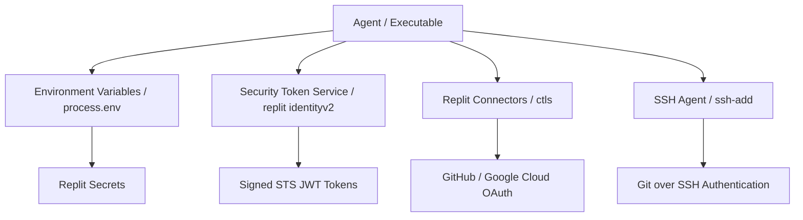

# Area 8 & 9 — Storage Capabilities & Secrets Infrastructure
## Storage Taxonomy, Database Engines, Secrets Management, and Auth Infrastructure

### 1. Complete Storage Taxonomy Matrix

| Storage Layer | Path / Location | Access Mechanism | Classification | Capacity / Persistence | Primary Use Case |
| :--- | :--- | :--- | :--- | :--- | :--- |
| **Workspace Storage** | `/home/runner/workspace` | POSIX File API (`fs`) | **PERSISTENT / LOCAL / AUTHENTICATED** | Multi-GB persistent workspace | Code, project files, configuration, build outputs |
| **Ephemeral Scratch** | `/tmp` | POSIX File API (`fs`) | **EPHEMERAL / LOCAL / UNAUTHENTICATED** | Fast RAM/disk scratch | Temporary build files, venvs, image conversions |
| **Replit Key-Value DB** | `REPLIT_DB_URL` | HTTPS REST API | **PERSISTENT / REMOTE / AUTHENTICATED** | Key-Value Store | App state, user sessions, key-value data |
| **Helium PostgreSQL** | Host `helium:5432` | TCP SQL Protocol | **PERSISTENT / LOCAL / AUTHENTICATED** | Full relational database | Production SQL schemas, migrations, relations |
| **SQLite Database** | Workspace / `/tmp` | File / `sqlite3` API | **PERSISTENT / LOCAL / AUTHENTICATED** | Single-file SQL DB | Embedded application databases, testing DBs |
| **Replit App Storage** | GCS Integration | Google Cloud SDK / API | **PERSISTENT / REMOTE / AUTHENTICATED** | Cloud Object Storage | Large media uploads, user files, document assets |
| **Package Caches** | `/home/runner/workspace/.cache` | Package managers | **PERSISTENT / LOCAL / UNAUTHENTICATED** | Cache directory | pnpm store, Playwright cache, build artifacts |

---

### 2. Secrets & Authentication Infrastructure

1. **Environment Secrets Manager**:
   - Secrets defined in Replit UI are securely injected as standard environment variables (`process.env`) into the microVM container upon startup.
2. **Replit Cryptographic Identity (`REPL_IDENTITY`)**:
   - Features a signed public token (`REPL_IDENTITY`) and private key (`REPL_IDENTITY_KEY`) used for asymmetric cryptographic verification between Repls.
3. **Security Token Service (STS) Minting**:
   - Binary: `/nix/store/.../bin/replit identityv2 create --audience <aud>`
   - Mints short-lived RS256-signed JWTs containing sandbox ID, customer ID, and organization ID for authenticating outbound calls.
4. **Replit Connectors Proxy**:
   - Path: `/repl/ctls/bin/`
   - Proxies `gh` and `gcloud` invocations to authenticate against user accounts without exposing raw OAuth refresh tokens to the container filesystem.
5. **SSH Agent Infrastructure**:
   - Pre-installed binaries: `ssh-agent`, `ssh-add`, `ssh-keygen`, `sshpass`.
   - Allows managing SSH keys for secure remote server administration.
