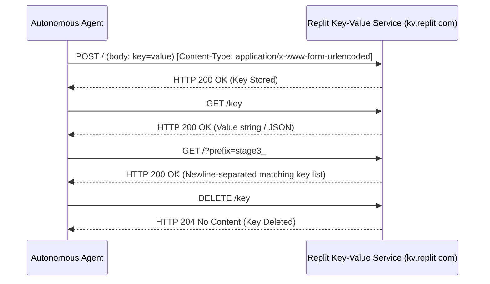

# Area 1 & 18 — Replit Deep Protocol Reverse Engineering
## Technical Architecture, Cryptographic Verification, and Protocol Specifications

### 1. Replit Security Token Service (STS v2) JWT Protocol

- **Binary Path**: `/nix/store/jyaxhs3n4wz1jsmbq6cl7asd1rsfissj-replit-cli-0.0.1/bin/replit identityv2`
- **Issuer (`iss`)**: `https://sts.replit.com`
- **Signing Algorithm**: RS256 (`RSA-SHA256`)
- **Key ID (`kid`)**: `sts:SHA256:OWVQlPc8VaDUE+A4IjKyQlNnymE5bKeSV3AIDqglsZI`
- **Header Decoded**:
  ```json
  {
    "alg": "RS256",
    "kid": "sts:SHA256:OWVQlPc8VaDUE+A4IjKyQlNnymE5bKeSV3AIDqglsZI",
    "tyd": "at+jwt"
  }
  ```
- **Payload Decoded**:
  ```json
  {
    "kind": "repl/main",
    "customer_id": "5017327",
    "org_id": "vr5yoc4tak",
    "sandbox_id": "6ea28db5-284d-4851-92ae-266f8317f17c",
    "repl_id": "6ea28db5-284d-4851-92ae-266f8317f17c",
    "rg_id": "6ea28db5-284d-4851-92ae-266f8317f17c",
    "client_id": "repl",
    "cell": "pike",
    "iss": "https://sts.replit.com",
    "aud": "api.custom.service",
    "exp": 1786573893
  }
  ```
- **Capability**: Mints identity assertions signed by Replit's STS for service-to-service authentication against external microservices.

---

### 2. Replit Key-Value Storage REST API Protocol Specification

- **Endpoint URL**: `$REPLIT_DB_URL` (`https://kv.replit.com/v0/...`)
- **Authentication**: JWT token embedded in URL path.
- **REST Operations**:



1. **Set Key**: `POST /` with `Content-Type: application/x-www-form-urlencoded` and body `key=value`. Returns HTTP 200.
2. **Get Key**: `GET /<key_name>`. Returns HTTP 200 with raw text/JSON body. If missing, returns HTTP 404.
3. **List Keys by Prefix**: `GET /?prefix=<prefix_string>`. Returns HTTP 200 with newline-delimited key list.
4. **Delete Key**: `DELETE /<key_name>`. Returns HTTP 204 No Content.

---

### 3. Helium PostgreSQL Server Architecture

- **Host**: `helium` (IP `172.24.0.3`)
- **Port**: `5432`
- **Database**: `heliumdb`
- **Default User / Password**: `postgres` / `password`
- **PostgreSQL Version**: `PostgreSQL 16.10 on x86_64-pc-linux-gnu, compiled by clang version 19.1.7, 64-bit`
- **Pre-installed System Extensions**:
  - `postgis` (v3.5.3) — Geospatial data support.
  - `uuid-ossp` (v1.1) — UUID generation functions.
  - `pg_trgm` (v1.6) — Trigram matching for fast text search.
- **Empirical Execution**: Table creation, transactional inserts, SELECT queries, and table dropping verified functional via `psql` and Node `pg` drivers.

---

### 4. Package Firewall Caching Proxy & Supply-Chain Delay Rule

- **NPM Registry Proxy**: `http://package-firewall.replit.local/npm/`
- **PyPI Index Proxy**: `http://package-firewall.replit.local/pypi/simple/`
- **Supply-Chain Security Rule (`pnpm-workspace.yaml`)**:
  ```yaml
  minimumReleaseAge: 1440 # Enforces 24-hour minimum publication age
  minimumReleaseAgeExclude:
    - '@replit/*'
    - stripe-replit-sync
  ```
- **Function**: Automatically intercepts npm package installations and blocks versions published within the last 24 hours to mitigate zero-day malicious package releases.
