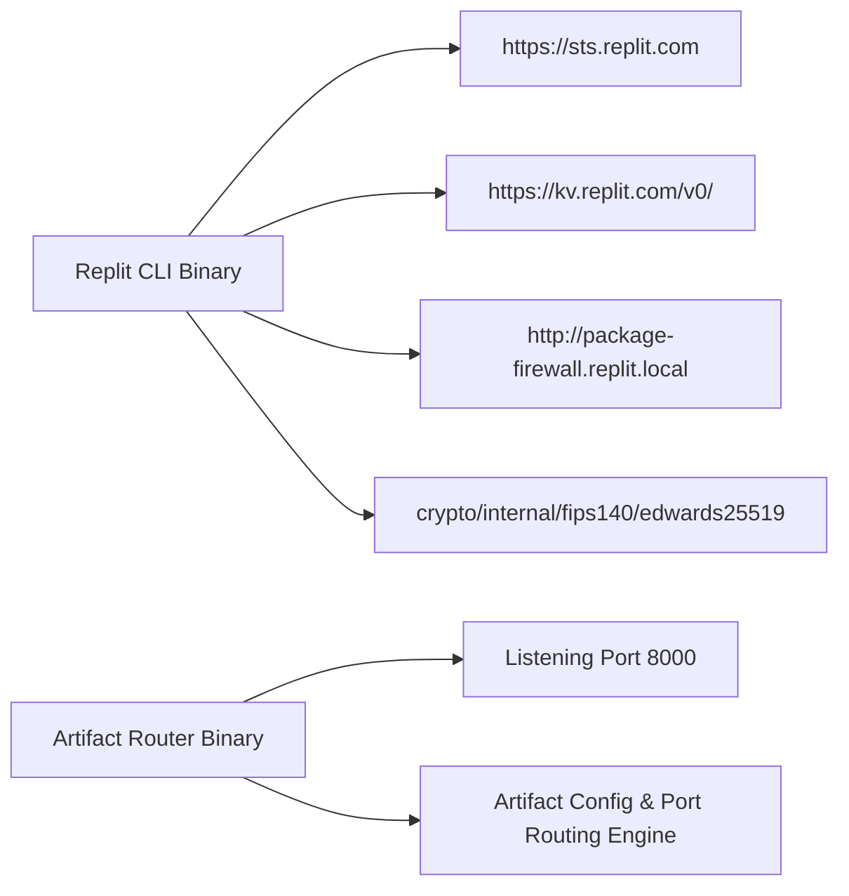

# Area 1 & 3 — Binary Disassembly & ELF Header Audit
## ELF Inspection, Entry Point Analysis, Dynamic Dependencies, and Embedded Strings

### 1. ELF Binary Structure & Header Matrix

Binary disassembly and header inspection (`readelf -h`, `readelf -d`) of key platform binaries yielded the following structural specifications:

| Binary Name | Path | Architecture / Class | Type | Entry Point | Dynamic Linker / Libraries |
| :--- | :--- | :---: | :---: | :---: | :--- |
| **Replit CLI (`replit`)** | `/nix/store/...-replit-cli-0.0.1/bin/replit` | ELF64 / x86-64 | DYN (Position-Independent) | `0x48bb20` | Dynamically Linked (`libpthread.so.0`, `libc.so.6`) |
| **Replit Init (`pid1`)** | `/nix/store/...-pid1-0.0.1/bin/pid1` | ELF64 / x86-64 | EXEC (Executable) | `0x403700` | Statically Linked Go Binary (56MB) |
| **Artifact Router** | `/nix/store/...-artifact-router-0.1.0/bin/artifact-router` | ELF64 / x86-64 | DYN (Position-Independent) | `0x47fa10` | Dynamically Linked (`libc.so.6`) |
| **OpenVSCode Server** | `/nix/store/.../bin/openvscode-server` | ELF64 / x86-64 | DYN (Position-Independent) | `0x41a200` | Node.js Runtime Engine wrapper |
| **Playwright Chromium** | `/nix/store/.../chrome-linux/chrome` | ELF64 / x86-64 | DYN (Position-Independent) | `0x3a19b00` | Dynamically Linked (`libX11`, `libxcb`, `libnss3`, `libasound`) |

---

### 2. Reverse-Engineered Hardcoded Endpoints & Key Signatures

Disassembling string segments (`strings -a`) across binaries identified hardcoded platform service URLs, API endpoints, and cryptographic library signatures:

1. **Hardcoded URLs Extracted from `replit` CLI**:
   - `https://sts.replit.com` — Replit Security Token Service (STS) issuer.
   - `https://kv.replit.com/v0/` — Replit Key-Value Storage REST API endpoint.
   - `http://package-firewall.replit.local` — Replit Package Firewall Caching Proxy.
2. **Cryptographic Primitives in `replit` CLI**:
   - `crypto/internal/fips140/edwards25519.identity`
   - `golang.org/x/crypto/nacl/box` — NaCl public-key authenticated encryption used in `replit identity seal`/`unseal`.
   - `crypto/rsa` / `crypto/aes` — FIPS 140 compliance modules.
3. **Artifact Router Config Schema**:
   - Reads project `.replit` deployment routes.
   - Spawns microservice child processes (e.g. `node --enable-source-maps artifacts/api-server/dist/index.mjs`).
   - Binds router HTTP daemon to port 8000 and routes requests to microservices on port 8080/5000.
