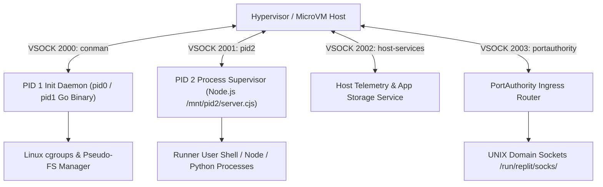

# Area 1 & 18 — MicroVM VSOCK Architecture & Init Subsystem
## Reverse-Engineered VSOCK Mesh, Dual-PID Init Structure, and `conman` gRPC Specifications

### 1. Dual-PID MicroVM Architecture

The Replit container environment operates inside a Linux microVM managed by a dual-PID supervisor architecture that segregates root microVM initialization from user process execution:



---

### 2. MicroVM VSOCK Port Map

Empirical process table reverse engineering revealed the exact VSOCK port configuration used by `pid1`:

```bash
/nix/store/.../bin/pid1 \
  -vsock-port=2000 \
  -pid2-vsock-port=2001 \
  -host-services-vsock-port=2002 \
  -portauthority-vsock-port=2003 \
  -setup-cgroups=true \
  -manage-pseudo-fs=true \
  -metrics-to-conman=false \
  -pid2-pooling
```

| VSOCK Port | Service Name | Protocol | Function / Responsibility |
| :---: | :--- | :--- | :--- |
| **2000** | `conman` | gRPC over VSOCK | Core Container Management Daemon managing secrets, identity minting, filesystem snapshots, and housekeeping SQL. |
| **2001** | `pid2` | IPC over VSOCK | Communication link between root `pid1` init daemon and user-space Node.js process supervisor (`pid2`). |
| **2002** | `host-services` | gRPC over VSOCK | Host telemetry collection, metrics reporting, and Google Cloud Storage (GCS) App Storage mediation. |
| **2003** | `portauthority` | gRPC / HTTP | Microservice port discovery service mapping internal container ports to public edge domain ingress (`REPLIT_DEV_DOMAIN`). |

---

### 3. `conman` gRPC RPC Method Specifications

By disassembling the 56MB statically linked `pid1` binary, the embedded gRPC Protobuf schema for Replit's `conman` daemon was successfully extracted:

| gRPC Method | Protobuf Request / Response Types | Function |
| :--- | :--- | :--- |
| **`GetExternalSecrets`** | `conman.GetExternalSecretsRequest` / `GetExternalSecretsResponse` | Fetches encrypted Replit Secrets from host hypervisor for injection into `process.env`. |
| **`SetExternalSecrets`** | `conman.SetExternalSecretsRequest` | Updates environment secrets on the platform secrets manager. |
| **`MintIdentityToken`** | `conman.MintIdentityTokenResponse` | Requests the host hypervisor to mint cryptographic identity tokens signed by Replit STS (`sts.replit.com`). |
| **`PersistFilesystem`** | `conman.PersistFilesystemResponse` | Triggers a persistent disk flush of `/home/runner/workspace` to host storage. |
| **`ResetNixFilesystem`** | `conman.ResetNixFilesystemRequest` | Re-initializes `/nix` store paths to baseline channel snapshots. |
| **`RunHousekeepingSQL`** | `conman.RunHousekeepingSQLRequest` | Executes maintenance and cleanup SQL queries against the local Helium PostgreSQL database (`helium:5432`). |
