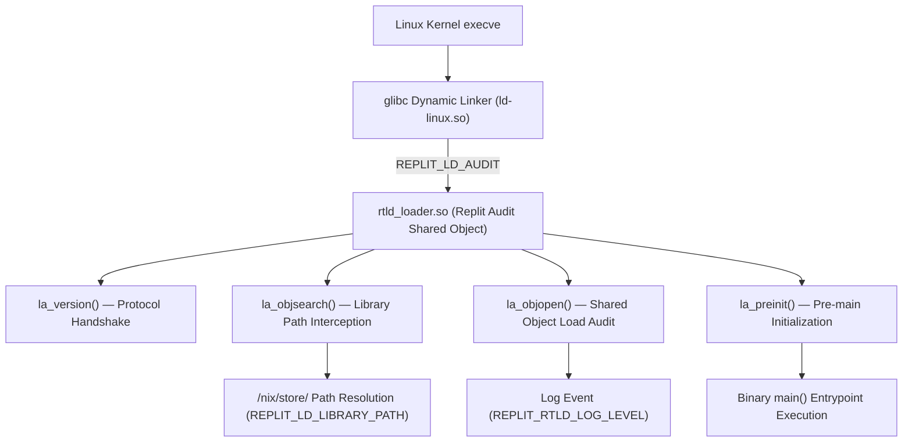

# Area 1 & 3 — Replit Dynamic Linker Audit Engine (`rtld_loader.so`)
## Reverse Engineering `REPLIT_LD_AUDIT`, glibc Dynamic Loader Hooks, and Library Resolution

### 1. Dynamic Loader Audit Architecture

In this environment, Replit injects a custom glibc dynamic linker audit shared library via environment variables:

```bash
REPLIT_LD_AUDIT=/nix/store/sj11ljhx4n79h9g0167f8lg8hp7n545m-replit_rtld_loader-1/rtld_loader.so
REPLIT_RTLD_LOADER=1
```

When any dynamically linked ELF binary executes in the container, glibc's dynamic linker (`ld-linux-x86-64.so.2`) loads `rtld_loader.so` into the process address space prior to program execution.



---

### 2. Disassembled Dynamic Symbols Matrix

Dynamic symbol analysis (`nm -D`) of `rtld_loader.so` revealed the exact function entry points implemented by Replit:

| Symbol Name | Type | Address | Function / Audit Responsibility |
| :--- | :---: | :---: | :--- |
| **`la_version`** | Exported Function | `0x1960` | Required glibc audit interface handshake function. Negotiates audit API version with dynamic linker. |
| **`la_objsearch`** | Exported Function | `0x19a0` | Intercepts dynamic shared object (`.so`) file name resolution. Redirects missing library lookups to `/nix/store` paths. |
| **`la_objopen`** | Exported Function | `0x1bb0` | Called whenever a shared library is opened. Audits memory map address, flags, and library identifier. |
| **`la_preinit`** | Exported Function | `0x1bf0` | Executed after all shared libraries are loaded but before `main()` of the target binary executes. |
| **`dynamic_lookup`** | Internal Function | `0x1210` | Resolves symbol bindings across loaded ELF shared objects at runtime. |
| **`parse_env`** | Internal Function | `0x13b0` | Reads and parses Replit environment variables (`REPLIT_LD_LIBRARY_PATH`, `REPLIT_RTLD_LOG_LEVEL`). |
| **`_output_cmdline`** | Internal Function | `0x1800` | Logs target binary command-line arguments to internal diagnostic log file `rtld_loader.log.`. |
| **`log_init` / `log_write`** | Internal Function | `0x1820` / `0x1700` | Initializes logging file descriptor `audit_log_fd` and writes dynamic linking events. |

---

### 3. Replit Internal Environment Controls

Reverse engineering string tables (`strings -a`) inside `rtld_loader.so` identified internal configuration parameters recognized by the loader:

1. **`REPLIT_LD_LIBRARY_PATH`**: Overrides default library search paths for Nix store binaries, allowing dependencies in different Nix store hashed directories to link dynamically at runtime.
2. **`REPLIT_RTLD_LOG_LEVEL`**: Controls audit verbosity (`debug`, `info`, `warn`).
3. **`rtld_loader.log.`**: Log file prefix used when audit logging is enabled.
