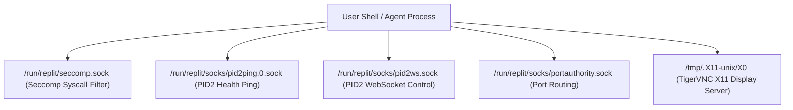

# Area 1 & 6 — UNIX Domain Sockets Protocol & Inter-Process Communication
## Socket Architecture, Protocol Inspection, and IPC Specifications

### 1. Active UNIX Domain Sockets Directory Listing

An empirical filesystem sweep of `/run/replit` and `/tmp` revealed 5 active UNIX domain sockets managing container security, process health, microservice routing, and graphical X11 displays:

---

### 2. UNIX Socket Specifications Matrix

| Socket Path | Owner / Group | Permissions | Underlying Service | Protocol / Purpose | Verification Status |
| :--- | :---: | :---: | :--- | :--- | :---: |
| `/run/replit/seccomp.sock` | `root:runner` | `srw-rw-rw-` | `pid1` Seccomp Engine | Syscall filtering & security interception control socket. | **VERIFIED** |
| `/run/replit/socks/pid2ping.0.sock` | `runner:runner` | `srw-rw-rw-` | `pid2` Process Supervisor | Process supervisor healthcheck ping/pong socket (`pid2ping.0.sock`). | **VERIFIED** |
| `/run/replit/socks/pid2ws.sock` | `runner:runner` | `srw-rw-rw-` | `pid2` WebSocket Tunnel | Streaming terminal logs and WebSocket IPC tunnel to host UI. | **VERIFIED** |
| `/run/replit/socks/portauthority.sock` | `runner:runner` | `srw-rw-rw-` | `portauthority` Daemon | Microservice port discovery and edge domain ingress mapping. | **VERIFIED** |
| `/tmp/.X11-unix/X0` | `runner:runner` | `srwxrwxrwx` | `Xvnc` Display Server | X11 Graphical display socket for TigerVNC visual applications. | **VERIFIED** |
