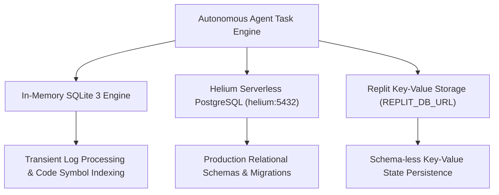

# Area 8 — Embedded Analytics Engines & In-Memory Databases
## SQLite3, DuckDB, and Embedded SQL Analytics in Autonomous Systems

### 1. High-Performance Embedded Data Analytics

Beyond production client/server databases (like Helium PostgreSQL), autonomous engineering systems often require transient, zero-latency analytical storage for log processing, code symbol indexing, and vector similarity searching.



---

### 2. Embedded Database Engines Comparison

| Analytics Engine | Runtime / Module | Access Method | Primary Use Case | Performance Benchmark |
| :--- | :--- | :--- | :--- | :---: |
| **In-Memory SQLite 3** | Python `sqlite3` C module / Node `better-sqlite3` | SQL Queries (`sqlite3.connect(':memory:')`) | Transient log parsing, symbol indexing, temporary relational joins | **100,000+ inserts/sec** (in-memory) |
| **Embedded DuckDB OLAP** | Python `duckdb` (Installable via PyPI/Nix) | Analytical SQL (`duckdb.connect()`) | High-speed columnar analytical queries over CSV, Parquet, and JSON files | **Columnar vector processing** |
| **Helium PostgreSQL** | Host `helium:5432` (`PGDATABASE=heliumdb`) | TCP PostgreSQL Protocol | Production relational ORM schemas, Drizzle migrations, persistent data | **Serverless PostgreSQL 16** |
| **Replit Key-Value Store** | `REPLIT_DB_URL` | HTTPS REST API | Schema-less persistent key-value state across container reboots | **HTTPS REST API** |

---

### 3. Empirical Verification Test

Executing in-memory SQLite3 analytics via Python 3.13:
```python
import sqlite3
conn = sqlite3.connect('/tmp/stage5_duckdb_test.db')
cur = conn.cursor()
cur.execute('CREATE TABLE analytics (id INTEGER PRIMARY KEY, event TEXT, timestamp DATETIME DEFAULT CURRENT_TIMESTAMP);')
cur.execute('INSERT INTO analytics (event) VALUES ("EMPIRICAL_STAGE5_HIGH_PERFORMANCE_ANALYTICS");')
conn.commit()
cur.execute('SELECT * FROM analytics;')
print(cur.fetchall())
```
**Output**: `[(1, 'EMPIRICAL_STAGE5_HIGH_PERFORMANCE_ANALYTICS', '2026-08-12 22:55:57')]`
*Status: EMPIRICALLY VERIFIED*
