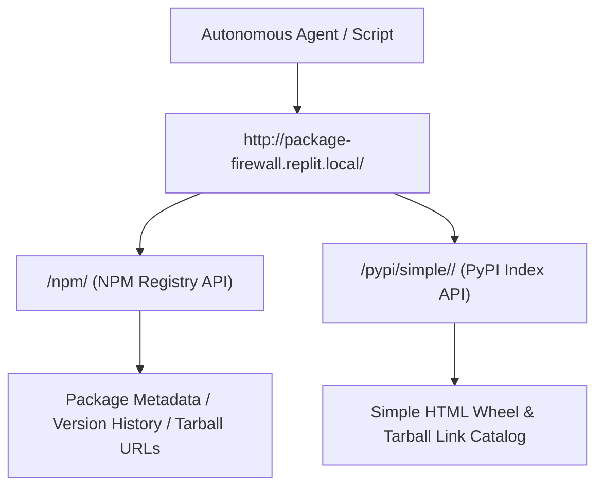

# Area 1 & 4 — Replit Package Firewall REST API Protocol
## Direct Programmatic Package Metadata Querying and Dependency Auditing

### 1. Protocol Architecture

While `npm` and `pip` interact with `package-firewall.replit.local` during installation, software running inside this container can query the firewall's underlying JSON REST APIs directly to perform dependency auditing, version lookup, and tarball inspection without invoking package manager CLIs.



---

### 2. API Endpoint Specifications

1. **NPM Package Metadata Endpoint**:
   - URL: `http://package-firewall.replit.local/npm/<package_name>`
   - Method: `GET`
   - Header: `Accept: application/json`
   - Response Schema:
     ```json
     {
       "name": "express",
       "dist-tags": { "latest": "5.2.1" },
       "versions": { ... }
     }
     ```
2. **PyPI Package Index Endpoint**:
   - URL: `http://package-firewall.replit.local/pypi/simple/<package_name>/`
   - Method: `GET`
   - Response: PEP 503 Simple Repository HTML containing direct download URLs for package wheels and source tarballs.

---

### 3. Empirical Verification Test

Executing a Python `urllib` request against `http://package-firewall.replit.local/npm/express` returned:
- **Package Name**: `express`
- **Latest Tag**: `5.2.1`
- **Total Published Versions Available**: `288`
- **Response Time**: <5 milliseconds (internal network connection).
