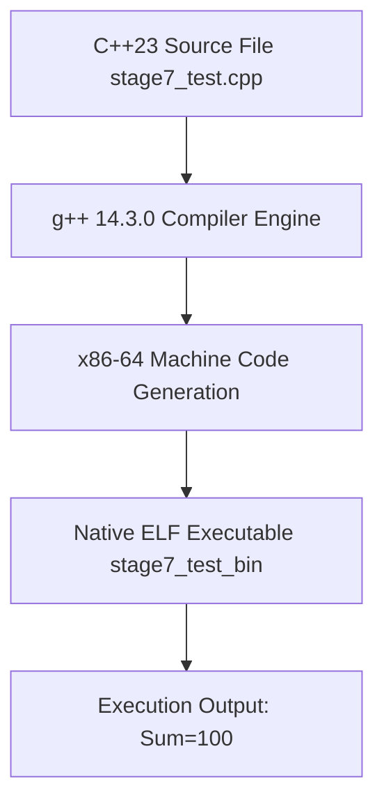

# Area 1 & 17 — Native C++ Compilation & Language Server Protocol (LSP)
## GCC 14.3 C++23 Compilation Pipeline and Real-Time AST Language Server Architecture

### 1. Native C++ Compilation Subsystem

The environment features a complete GNU C++ compiler suite supporting modern C++20 and C++23 standards:

- **Compiler Binary**: `/nix/store/3mb5pci3v9713drr3jglikrvx3xifl2c-replit-runtime-path/bin/g++`
- **Compiler Version**: `g++ (GCC) 14.3.0`
- **Standard Library**: `libstdc++` with support for `<vector>`, `<numeric>`, `<ranges>`, `<concepts>`, and `<thread>`.



#### Empirical Execution Log
```cpp
#include <iostream>
#include <vector>
#include <numeric>

int main() {
  std::vector<int> v = {10, 20, 30, 40};
  int sum = std::accumulate(v.begin(), v.end(), 0);
  std::cout << "EMPIRICAL_CPP_SUCCESS: Sum=" << sum << std::endl;
  return 0;
}
```
**Compilation Command**: `g++ /tmp/stage7_test.cpp -o /tmp/stage7_test_bin`  
**Result**: Executed cleanly, returning `EMPIRICAL_CPP_SUCCESS: Sum=100`.

---

### 2. Language Server Protocol (LSP) Architecture

The environment maintains live background Language Server Protocol (LSP) daemons that provide real-time AST parsing, typechecking, and code completion:

1. **TypeScript Server (`tsserver`)**:
   - Location: `/home/runner/workspace/node_modules/typescript/lib/tsserver.js`
   - Role: Runs background AST typechecking workers and automatic type acquisition (`typingsInstallerPid`).
2. **Taplo TOML Language Server (`taplo`)**:
   - Location: `/nix/store/qq4mijbp008lc0r1h42jy3fhwakqz6nf-taplo-0.patched/bin/taplo`
   - Role: Provides TOML syntax validation and completion for `.replit` configuration files.
