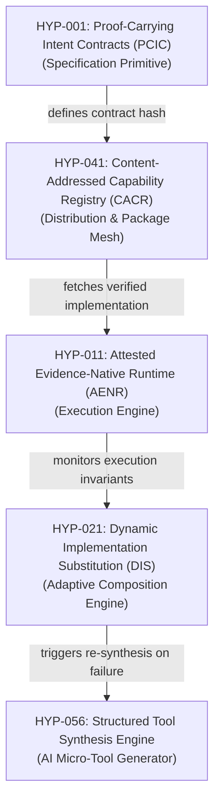

# Deliverable 05 — Top 20 Candidates Deep Analysis & Idea Graph

**Laboratory Identifier**: Autonomous Frontier Technology Research Lab  
**Filtering Objective**: Narrow 100 hypotheses to Top 20 based on structural leverage, prior-art differentiation, and ecosystem potential.

---

## 1. Idea Graph & Architectural Synergy

The top candidate ideas do not exist in isolation. When combined, they form a cohesive new software paradigm:

---

## 2. Deep Evaluation of Top 20 Candidates

| Rank | ID | Name | Primitive Category | Primary Leverage | Key Failure Mode / Risk |
| :--- | :--- | :--- | :--- | :--- | :--- |
| 1 | **HYP-001** | Proof-Carrying Intent Contracts (PCIC) | Programming Model | Decouples program specification from raw implementation code using SMT solver certificates. | SMT proof generation timeout on non-linear math. |
| 2 | **HYP-041** | Content-Addressed Capability Registry (CACR) | Package Distribution | Replaces name-based package managers (npm) with contract-hash capability lookup. | Registry index search complexity under millions of specs. |
| 3 | **HYP-011** | Attested Evidence-Native Runtime (AENR) | Runtime Engine | Guarantees sandboxed execution of WebAssembly code carrying verified evidence proofs. | Proof checking latency overhead per WASM invocation. |
| 4 | **HYP-021** | Dynamic Implementation Substitution (DIS) | Composition Model | Enables hot-swapping library implementations at runtime based on verified telemetry. | State migration corruption between substituted algorithms. |
| 5 | **HYP-056** | Structured Tool Synthesis Engine | AI Boundary | Allows AI agents to compile temporary micro-tools with verified execution contracts. | Hallucinated pre/post-conditions in edge cases. |
| 6 | **HYP-083** | Dynamic Entropy Leak Detection | Security Model | Intercepts side-channel leaks and unexpected I/O streams at runtime sandbox gates. | False positives on legitimate compressed payloads. |
| 7 | **HYP-033** | Differential Executable Verification | Verification System | Measures semantic divergence by dual-executing synthesized code vs reference models. | 2x execution CPU cost during differential testing phase. |
| 8 | **HYP-027** | Structural Interface Matching (SIM) | Interop Primitive | Replaces nominal type matching with automated behavioral contract structural subtyping. | Expressiveness limits in highly abstract polyglot APIs. |
| 9 | **HYP-042** | Implementation-Neutral Dependency Graphs | Package Resolution | Resolves dependency trees by contract satisfaction rather than static version strings. | Combinatorial explosion during multi-package dependency solver runs. |
| 10 | **HYP-045** | Decentralized P2P Artifact Graph | Distribution Network | Distributes content-addressed capability binaries across peer-to-peer DHT nodes. | Cold-start retrieval latency for rare micro-capabilities. |
| 11 | **HYP-002** | Affine Capability Types (ACT) | Programming Model | Consumes resource access tokens on call, preventing capability leaks. | Borrow checker complexity for dynamic agent scripts. |
| 12 | **HYP-004** | Semantic Interface Definition Language (SIDL) | Specification | Expresses space/time complexity bounds inside interface schemas. | Difficulty quantifying execution bounds on unknown hardware. |
| 13 | **HYP-012** | Capability Isolation Micro-Kernel (CIMK) | Runtime Architecture | Microsecond micro-sandboxing for granular micro-function calls. | Context switch overhead across IPC boundaries. |
| 14 | **HYP-031** | Continuous SMT Verification Engine | Verification System | Continuously solves Z3 background assertions on code modification. | CPU usage spike during intensive code editing sessions. |
| 15 | **HYP-032** | Property Certificate Packaging (PCP) | Package Verification | Bundles mathematical proof certificates inside library tarballs. | Maintenance overhead for library maintainers updating proofs. |
| 16 | **HYP-051** | Deterministic Neural Executable Protocol | AI Boundary | Bridges neural outputs to compiled WebAssembly state machines. | Schema mismatch during LLM model weight upgrades. |
| 17 | **HYP-055** | Self-Verifying Code Repair Loops | AI Repair | Automatically repairs failing unit tests using SMT validation. | Loop divergence if test suite has incomplete assertions. |
| 18 | **HYP-061** | Content-Addressed Build Cache Graph | Build Infrastructure | Caches compilation at structural expression levels rather than file levels. | Disk space accumulation of unused AST build artifacts. |
| 19 | **HYP-071** | Intent-Based Distributed State (IBDS) | Distributed Consensus | Replaces log consensus with target invariant state consensus. | High consensus round latency under network partitioning. |
| 20 | **HYP-091** | Content-Addressable Memory Graph (CAMG) | Memory Model | Stores RAM values as immutable content-addressed nodes. | Pointer dereference overhead in deep pointer chains. |

---
